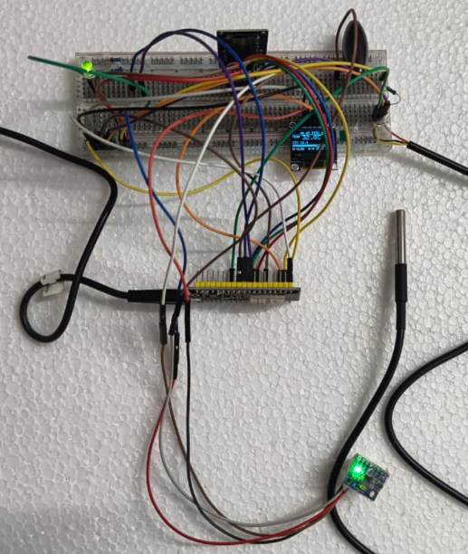
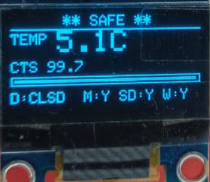
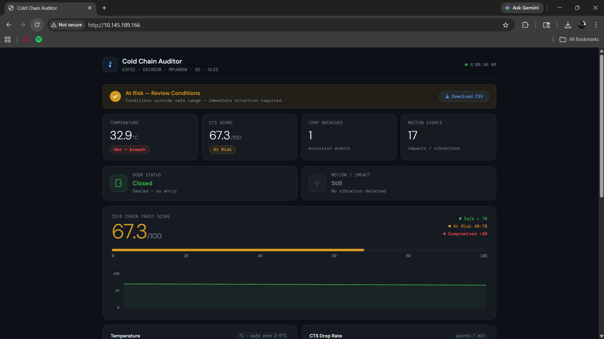
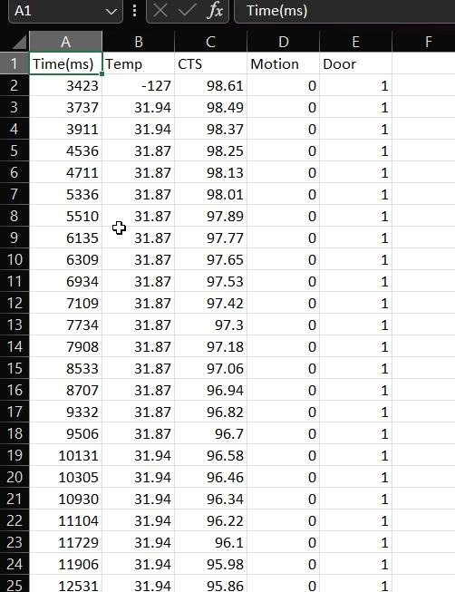
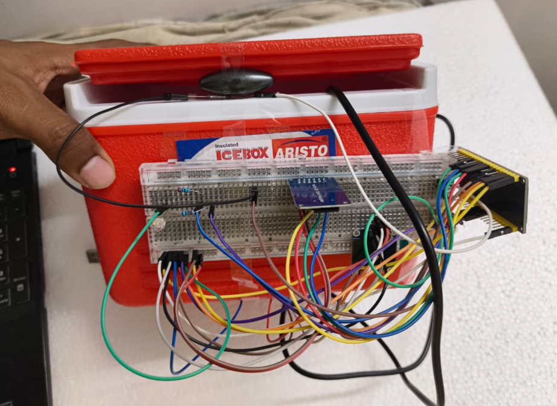

# ❄️ Cold Chain Auditor

A smart IoT system that monitors temperature, handling, and tampering, and converts them into a real-time **Cold Chain Trust Score (CTS)**.

---

## 🚀 Features

- 🌡️ Temperature monitoring (DS18B20)
- 📦 Motion detection (MPU6050)
- 🧲 Door tamper detection (Reed Switch)
- 🧠 Cold Chain Trust Score (CTS)
- 📺 OLED display
- 💡 LED alerts
- 🌐 Web dashboard
- 💾 SD card logging
- ⬇️ CSV download via browser

---

## 🧠 CTS Concept

CTS (Cold Chain Trust Score) is a value from 0–100 that represents the integrity of storage conditions.

- 70–100 → Safe  
- 40–70 → At Risk  
- 0–40 → Compromised  

---

## 🔧 Hardware Used

- ESP32  
- DS18B20  
- MPU6050  
- Reed Switch  
- OLED (SSD1306)  
- SD Card Module  

---

## 📊 System Architecture

Sensors → Processing → CTS → Output → Logging → Dashboard

---

## 🌐 Web Features

- Real-time dashboard  
- Graphs  
- CSV download  

---

## 📁 Data Logging

Data stored as:

log.csv

Format:

Time(ms),Temp,CTS,Motion,Door

---

## 📸 Project Images

## 📜 License

MIT License
